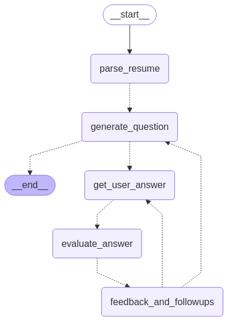

# AI Interviewer

## Overview

AI Interviewer is an intelligent, speech-based interview simulation tool built using Whisper for speech-to-text transcription, WebRTC VAD for voice activity detection, and a LangGraph-powered interview engine. It dynamically conducts interviews, processes responses in real-time, provides feedback, asks contextual follow-up questions and scores performance through a natural conversation flow.

## Features

- **Voice-activated interview**: Uses VAD to detect speech and record only when you’re speaking.
- **Real-time transcription**: Transcribes your answers using Whisper (Tiny to Large models supported).
- **Dynamic questioning**: Asks intelligent follow-up questions based on your resume and selected tags.
- **Scoring system**: Provides a final score with percentage based on your performance.
- **Interactive flow**: Uses a recursive LangGraph agent for dynamic conversation.
- **Tested integration**: Works smoothly with both terminal-based input and automated pipelines.

## Tools & Libraries Used:

1. LangChain + LangGraph (for interview engine)
2. gTTS + pygame (for Text to Speech)
3. openai-whisper + pyaudio + webrtcvad + scipy (for Speech to Text)

## AI Interviewer Architecture



## Setup

### 1. Clone the Repository

```bash
git clone git@github.com/parth-singh71/ai_interviewer.git
cd ai_interviewer
```

### 2. Create & Activate Virtual Environment

```bash
python -m venv venv
source venv/bin/activate  # Mac/Linux
venv\Scripts\activate  # Windows
```

### 3. Install Dependencies

```bash
pip install -r requirements.txt
```

### 4. Add Environment Variables

Since this project uses `gpt-4o-mini` for text generation, you will need to add an API Key from OpenAI for this project to work.

#### **For Linux (Bash)**

```bash
echo 'export OPENAI_API_KEY="YOUR_API_KEY"' >> ~/.bashrc && source ~/.bashrc
```

If using a login shell, use `~/.profile` instead of `~/.bashrc`.

#### For MacOS (Bash Shell):

```bash
echo 'export OPENAI_API_KEY="YOUR_API_KEY"' >> ~/.bash_profile && source ~/.bash_profile
```

#### For MacOS (Zsh Shell):

```sh
echo 'export OPENAI_API_KEY="YOUR_API_KEY"' >> ~/.zshrc && source ~/.zshrc
```

#### For Windows (Powershell):

```powershell
setx OPENAI_API_KEY "YOUR_API_KEY"
```

Note: For Windows users, restarting the terminal (or system) is required after using setx.

### 5. Checkout `interviewer.ipynb` to get started
